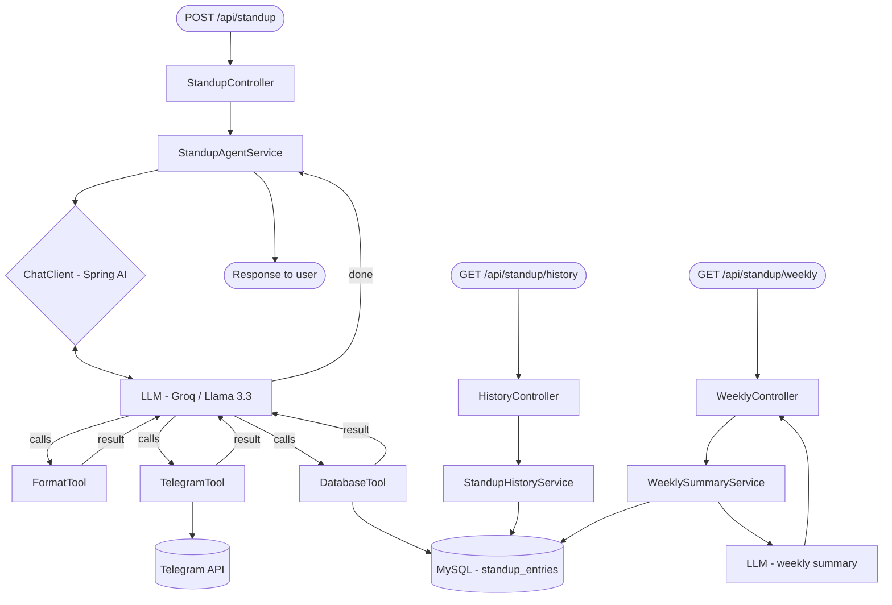

# 🤖 StandupAI — Daily Standup Agent

> An AI-powered agent built with Spring Boot and Spring AI that formats your raw standup notes into professional bullet points, delivers them to your Telegram, and tracks your progress over time.

---

## What it does

You send this:
```
fixed login bug, working on dashboard, blocked on payment API docs from third party
```

The agent thinks, formats, delivers, and saves. You get this in your Telegram:

```
👤 Sangam's Standup — 15 Mar 2026

✅ Fixed the login bug
🔨 Working on dashboard UI
🚧 Blocked on payment API docs (waiting on third party)
📅 Today: complete dashboard, follow up on API docs
```

And it saves everything to MySQL so you can query your history and get a weekly AI summary of your entire week.

---

## Tech stack

| Layer | Technology |
|---|---|
| Backend | Spring Boot 3.4.1 |
| AI Framework | Spring AI 1.0.0 |
| LLM | Llama 3.3 70B via Groq |
| Frontend | React, Redux, Tailwind CSS |
| Database | MySQL 8 |
| Messaging | Telegram Bot API |

---

## 🏗️ Architecture

For a detailed look at the end-to-end flow and UI gallery, see **[ARCHITECTURE_FLOW.md](ARCHITECTURE_FLOW.md)**.



The agent loop:
1. LLM receives raw update
2. Calls `FormatTool` → structures into emoji bullets
3. Calls `TelegramTool` → posts to your Telegram
4. Calls `DatabaseTool` → saves to MySQL
5. Returns confirmation

---

## Getting started

### Prerequisites

- Java 21, Maven, MySQL 8
- Node.js (for Frontend)
- Groq API key, Telegram bot token

### 1. Setup Backend
- Configure `application.properties` with your keys.
- Run: `./mvnw spring-boot:run`

### 2. Setup Frontend
- `cd frontend && npm install && npm run dev`

---

## License

MIT