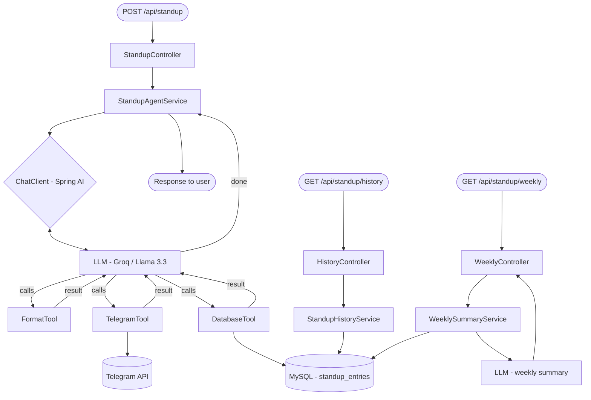

# 🤖 StandupAI — Daily Standup Agent

> An AI-powered agent built with Spring Boot and Spring AI that formats your raw standup notes into professional bullet points, delivers them to your Telegram, and tracks your progress over time.

---

## What it does

You send this:
```
fixed login bug, working on dashboard, blocked on payment API docs from third party
```

The agent thinks, formats, delivers, and saves. You get this in your Telegram:

```
👤 Sangam's Standup — 15 Mar 2026

✅ Fixed the login bug
🔨 Working on dashboard UI
🚧 Blocked on payment API docs (waiting on third party)
📅 Today: complete dashboard, follow up on API docs
```

And it saves everything to MySQL so you can query your history and get a weekly AI summary of your entire week.

---

## Tech stack

| Layer | Technology |
|---|---|
| Backend | Spring Boot 3.4.1 |
| AI Framework | Spring AI 1.0.0 |
| LLM | Llama 3.3 70B via Groq (free) |
| Database | MySQL 8 |
| Messaging | Telegram Bot API |
| Language | Java 21 |

---

## Architecture



The agent loop:
1. LLM receives raw update
2. Calls `FormatTool` → structures into emoji bullets
3. Calls `TelegramTool` → posts to your Telegram
4. Calls `DatabaseTool` → saves to MySQL
5. Returns confirmation

The model decides the order and when to stop — you never hardcode the steps.


## Getting started

### Prerequisites

- Java 21
- Maven
- MySQL 8
- Groq API key (free at [console.groq.com](https://console.groq.com))
- Telegram bot token (free via [@BotFather](https://t.me/BotFather))

### 1. Clone the repo

```bash
git clone https://github.com/Sangam5756/standup-ai-agent.git
cd standup-ai-agent
```

### 2. Create the database

```sql
CREATE DATABASE standupdb;
```

### 3. Create your `.env` file

```env
GROQ_API_KEY=gsk_your_key_here
DB_USER=root
DB_PASS=yourpassword
TELEGRAM_BOT_TOKEN=your_bot_token
TELEGRAM_CHAT_ID=your_chat_id
```

> Never commit `.env` to GitHub — it's already in `.gitignore`

### 4. Get your Telegram Chat ID

1. Search `@BotFather` on Telegram → `/newbot` → copy your token
2. Send any message to your bot
3. Open in browser:
```
https://api.telegram.org/bot<YOUR_TOKEN>/getUpdates
```
4. Copy the `id` value inside `"chat"` — that's your Chat ID

### 5. Run

```bash
./mvnw spring-boot:run
```

MySQL table is created automatically on first run.

---

## API reference

### Submit a standup

```http
POST /api/standup
Content-Type: application/json

{
  "developerName": "Rahul",
  "rawUpdate": "fixed login bug, working on dashboard, blocked on payment API docs"
}
```

Response:
```
Standup formatted and sent to Telegram successfully. Saved to database.
```

---

### View standup history

```http
GET /api/standup/history
```

Response:
```json
[
  {
    "id": 1,
    "developerName": "Sangam",
    "rawUpdate": "fixed login bug...",
    "formattedStandup": "👤 Sangam's Standup...",
    "telegramSent": true,
    "createdAt": "2026-03-15T14:30:00"
  }
]
```

---

### Weekly AI summary

```http
GET /api/standup/weekly
```

Response: An LLM-generated paragraph summarising your last 7 days of standups — key accomplishments, recurring themes, and blockers.

---

## Database schema

```sql
CREATE TABLE standup_entries (
  id                BIGINT       AUTO_INCREMENT PRIMARY KEY,
  developer_name    VARCHAR(100) NOT NULL,
  raw_update        TEXT,
  formatted_standup TEXT,
  telegram_sent     BOOLEAN      DEFAULT FALSE,
  created_at        DATETIME
);
```

---

## How the agent works

This is not a simple API call. The LLM drives the execution:

```
User input
    │
    ▼
LLM thinks: "I need to format this first"
    │
    ▼
Calls FormatTool("Sangam", "fixed login bug...")
    │
    ▼
LLM sees formatted result, thinks: "Now send to Telegram"
    │
    ▼
Calls TelegramTool(formattedMessage)
    │
    ▼
LLM sees SUCCESS, thinks: "Now save to DB"
    │
    ▼
Calls DatabaseTool(name, raw, formatted, true)
    │
    ▼
LLM has completed all steps → returns final confirmation
```

You define the tools. The model decides the order, the arguments, and when it is done.

---

## Environment variables

| Variable | Description |
|---|---|
| `GROQ_API_KEY` | Your Groq API key |
| `DB_USER` | MySQL username |
| `DB_PASS` | MySQL password |
| `TELEGRAM_BOT_TOKEN` | Token from @BotFather |
| `TELEGRAM_CHAT_ID` | Your personal Telegram chat ID |

---


## License

MIT