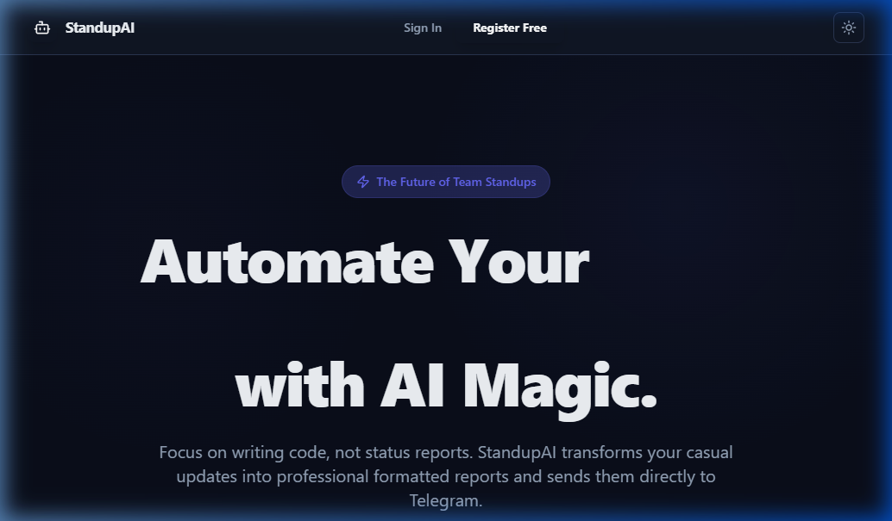
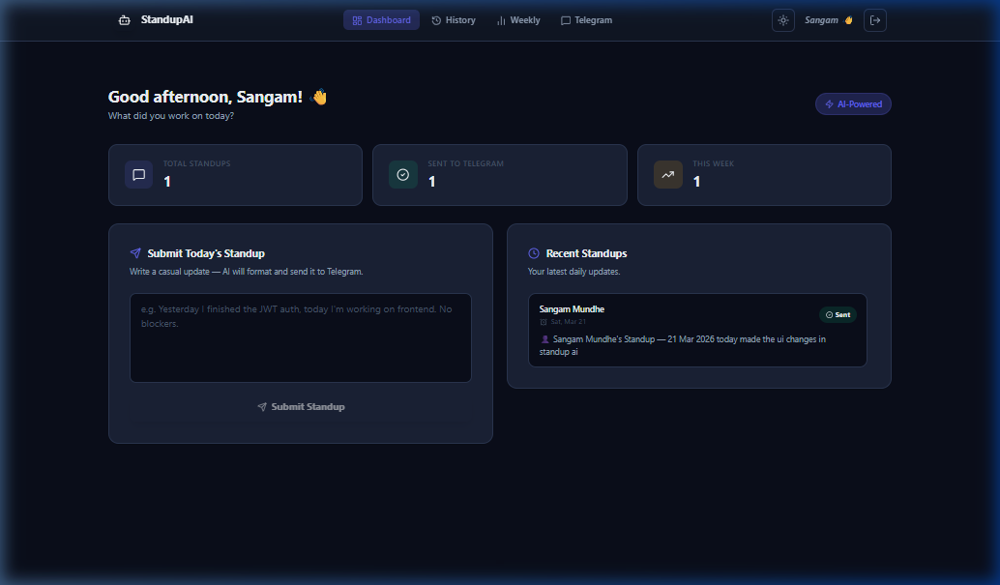
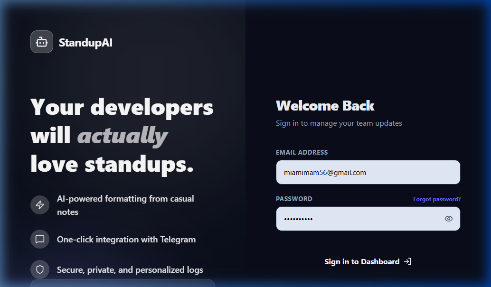
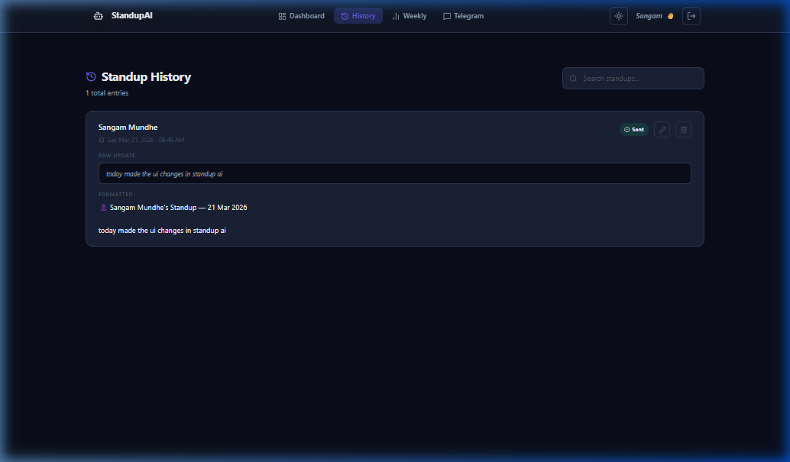
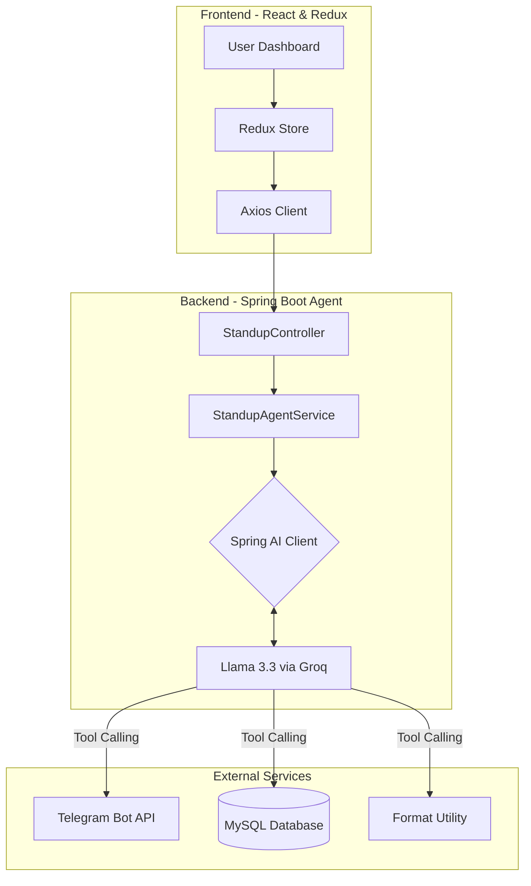

# 🤖 StandupAI — Automated Daily Standup Agent

> **Transform your casual developer notes into professional standup reports.**
> Built with Spring Boot, Spring AI, React, and Redux. Delivered via Telegram.

---

## 📸 UI Gallery

### 🏠 Landing Page & Brand Pitch
A premium, mobile-responsive landing page that introduces StandupAI to new users.

### 🚀 Developer Dashboard
The unified hub for submitting daily updates, tracking statistics, and viewing recent activity.

### 🤖 Smart Auth (Login/Register)
Modern split-screen authentication with persuasive testimonials and feature highlights.

### 📜 Standup History & Edit
Searchable, paginated log of all past submissions with one-click edit functionality.

---

## 🏗️ End-to-End Architecture

StandupAI follows a modern full-stack architecture, separating the **AI-driven Agentic Backend** from the **State-managed Frontend**.

### 1. High-Level System Flow

### 2. The Agentic Loop (Backend)
Instead of a rigid procedural flow, the backend uses an **Autonomous Agent** powered by Spring AI. When a user submits raw text, the LLM determines the execution path:
1. **Format**: The LLM calls the `FormatTool` to wrap raw notes into professional, emoji-rich bullets.
2. **Deliver**: The LLM calls the `TelegramTool` to broadcast the formatted report to the configured chat.
3. **Persist**: The LLM calls the `DatabaseTool` to save both raw and formatted versions.
4. **Confirm**: Once all tool calls return SUCCESS, the agent provides a final response to the user.

### 3. Global State Management (Frontend)
The frontend uses **Redux Toolkit** to minimize redundant API calls and ensure UI consistency:
- **Centralized Store**: All standup history is cached in the Redux store.
- **Thunks**: Asynchronous actions handle API interactions and update the UI state optimistically.
- **Caching**: A 1-minute cache prevents unnecessary history fetches when navigating between pages.
- **Instant Updates**: Submitting or editing a standup updates the store immediately, reflecting changes across the Dashboard and History pages without a full refresh.

---

## 🛠️ Tech Stack

- **Backend**: Java 21, Spring Boot 3.4.1, Spring AI, Groq (Llama 3.3 70B).
- **Frontend**: React 18, Vite, Tailwind CSS (v4), Redux Toolkit, Lucide Icons.
- **Database**: MySQL 8.
- **Messaging**: Telegram Bot API.
